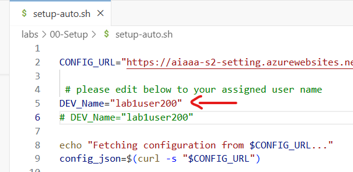

import Tabs from '@theme/Tabs';
import TabItem from '@theme/TabItem';

## Lab Code Repository

The source code for the labs is hosted on GitHub. You can access the repository using the following link:
https://github.com/GitHub-Insight-ANZ-Lab/aiapps-agents-in-a-day

The repository contains the following folders:

- Lab exercises: `~/labs`
- Chatbot Backend Node.js API: `~/apps-chat/backend`
- Chatbot Frontend React Web App: `~/apps-chat/chatbot`
- Game Server: `~/apps-rps/rps-game-server`
- Game Client: `~/apps-rps/rps-game-client`
- Game Agent: `~/apps-rps/rps-game-agent`
- Game MCP Server: `~/apps-rps/rps-game-mcp`
- Bicep Deployment: `~/infra`

## Lab Environment Setup

<Tabs>
  <TabItem value="codespaces" label="GitHub Codespaces (Recommended)" default>
Follow the steps below to set up the lab environment using GitHub Codespaces:

1. **Create a GitHub Account**: If you don't have a GitHub account, you can create one [here](https://github.com/join).

2. **Open in Codespaces**: Navigate to the [aiapps-agents](https://github.com/GitHub-Insight-ANZ-Lab/aiapps-agents-in-a-day) repository. Click on the "Code" button and select "Open with Codespaces". If you don't see this option, ensure you have GitHub Codespaces enabled for your account.

3. **Create a New Codespace**: Click on "New codespace" to create a new development environment. This will set up a Codespace with all the necessary tools and dependencies pre-installed.

4. The Codespace will take a few minutes to set up. It will install the following tools and dependencies for you:

  - [Node.js](https://nodejs.org/en/download/prebuilt-installer) (v20.17)
  - [Azure CLI](https://learn.microsoft.com/en-us/cli/azure/install-azure-cli)
  - [Git](https://git-scm.com/downloads)

5. **Start Coding**: Once the Codespace is ready, you can start coding and follow the lab instructions directly within the browser-based VS Code environment. The changes you make in your Codespace are saved automatically. If you stop and restart your Codespace, your changes will persist.

**Note** - You can also connect to your Codespace from your local VS Code editor by installing the [GitHub Codespaces extension](https://marketplace.visualstudio.com/items?itemName=GitHub.codespaces).
  </TabItem>
  <TabItem value="local" label="Local Computer">
1. Install the following tools on your machine:

   - [Visual Studio Code](https://code.visualstudio.com/download)
   - [Node.js](https://nodejs.org/en/download/prebuilt-installer) (v20.17)
   - [Azure Cli (include Bicep)](https://learn.microsoft.com/en-us/cli/azure/install-azure-cli)
   - [Git](https://git-scm.com/downloads)


   :::info
   If your device has restrictions, you can download the `VS Code`, `Node.js`, and `Azure CLI` zip packages. Then, add the `Node.js` and `Azure CLI\bin` folder paths to your environment variables. You will need to restart `VS Code` for the changes to take effect.

   ```bash
   set PATH=%PATH%;C:\your\path\here\;
   ```
   :::


2. Visit our [aiapps-agents](https://github.com/GitHub-Insight-ANZ-Lab/aiapps-agents-in-a-day) repository in GitHub. This repository contains the source code and guides for completing the labs.

    ```bash
    git clone https://github.com/GitHub-Insight-ANZ-Lab/aiapps-agents-in-a-day.git
    ```

3. Navigate to the repository folder and open it in Visual Studio Code:

    ```bash
    cd aiapps-agents
    code .
    ```

#### Windows Sandbox

If you are using Windows, you can easily start up a Windows Sandbox to keep your local machine clean. Read more https://learn.microsoft.com/en-us/windows/security/application-security/application-isolation/windows-sandbox/windows-sandbox-overview

Run the following command in PowerShell to enable Windows Sandbox feature:

```powershell
Enable-WindowsOptionalFeature -FeatureName "Containers-DisposableClientVM" -All -Online
```

Once restarted, search `Windows Sandbox` in `Start` button.
  </TabItem>
</Tabs>


## Lab Configuration & Verify Connection

Let us test the connection to Cosmos DB instance and OpenAI service.

1.  Open VS Code and navigate to the `aiapps-agents` repository folder. If you are using Codespaces, you should already be in the repository folder.

2.  Navigate to the setup folder `~/labs/00-Setup/` within the repository. Go to `Terminal` window in VS Code.
    ```bash
    cd labs/00-Setup/
    ```

3.  Open `setup.sh`, let's update `<DEV_Name>` setting with your own database name. Replace `add_value` with your assigned lab username (for example: `lab1user200`).

    :::info
    if you are deploying your own Azure resources (optional), please update keys and connection string with your own.
    :::

    


4. **Use Copilot Agent Mode to Update the Script Automatically**

   Instead of manually editing the `.sh` script file, you can use GitHub Copilot in Agent mode to automate this process:

   - Open Copilot Agent mode in VS Code.
   - Go to https://aiaaa-s2-setting.azurewebsites.net/api/configuration/all and copy all the configuration values.
   - Paste the values into the Copilot chat and ask Copilot to replace the placeholder values in your setup script (e.g., `setup.sh` or `setup.bat`).
   - If successful, Copilot will update the script for you—no manual editing needed!

   > This demonstrates how Copilot can be used for real-world automation and configuration tasks.

5.  Go to terminal windows, save the `setup.sh` file and run below bash command to replace all variables in the repo. If you need to run `setup.sh` again to fix typos, you need to revert previous changes in `Source Control` tab or ask us for help.

    ```bash
    chmod +x setup.sh
    ./setup.sh
    ```

    :::info Plan B (Skip if 5 worked)

    If the above step does not work for you, use the `setup-auto.js` script to automatically fetch all configuration values from https://aiaaa-s2-setting.azurewebsites.net/api/configuration/all and replace the placeholders in your setup script. Run it to complete the replacement process.

    Open `setup-auto.sh`, let's update `<DEV_Name>` setting with your own database name. Replace `add_value` with your assigned login name `lab1user200` (for example: lab1user200).

    

    ```bash
    chmod +x setup-auto.sh 
    ./setup-auto.sh
    ```
    :::

    :::info Plan C (Skip if Plan B worked)
    If you have issue running above script, you can also carry out variable replacement manually. 
    - Switch to VS Code `Search` tab, replace `<DEV_Name>` placeholder with your own database name. 
    - Search for `<DEV_Name>` and replace with your assigned lab username (for example: `lab1user200`). 
    - Then click `Replace All` icon, there will be multiple items to be replaced. The placeholder string will be replaced in the whole repo so that you have a dedicated database on the shared Cosmos DB instance.

    
    :::

6.  Install node packages for test program.

    ```bash
    npm install
    ```

7.  Test Connection to CosMos Db and OpenAI service. Run the following command in the terminal window to execute the script:

    ```bash
    node test.js
    ```

8.  If you see below message in the console, you are ready to go! otherwise, please `Raise your hand and ask for help`. Note, you do not need to commit any changes of the `.env` files to Git repo.

    


## Azure Resources & Deployment

The Azure Resources required for the labs have already been provisioned. The details of the shared Azure resources are provided in the table below. You will need these details to connect to the Azure services during the labs.

:::info
If you have an Azure Subscription, you can provision these resources yourself using the instructions and `bicep` files provided on the `Azure Deployment Guide` page. However, this is optional.

You can also create a free Azure account with $200 credit to use on Azure services within 30 days. If you are a Visual Studio subscriber, you can activate monthly Azure credits. Refer to the links below for more information.

- https://azure.microsoft.com/en-au/pricing/purchase-options/azure-account?icid=azurefreeaccount
- https://azure.microsoft.com/en-au/pricing/member-offers/credit-for-visual-studio-subscribers
:::

### Azure AI Proxy Playground

| Description          | Value                                                  |
| -------------------- | ------------------------------------------------------ |
| AI Proxy Playground  | https://aiaaa-s2-playground.azurewebsites.net |
| Azure OpenAI API Key | Retrieve from https://aiaaa-s2-setting.azurewebsites.net                       |

### Azure OpenAI Resource Configuration

| Variable Name                               | Value                                             |
| ------------------------------------------- | ------------------------------------------------- |
| AZURE_OPENAI_API_INSTANCE_NAME              | aiaaa-s2-openai                          |
| AZURE_OPENAI_API_ENDPOINT                   | https://aiaaa-s2-openai.openai.azure.com// |
| AZURE_OPENAI_API_KEY                        | Retrieve from https://aiaaa-s2-setting.azurewebsites.net                  |
| AZURE_OPENAI_API_DEPLOYMENT_NAME            | completions                                       |
| AZURE_OPENAI_API_EMBEDDINGS_DEPLOYMENT_NAME | embeddings                                        |
| AZURE_OPENAI_API_VERSION                    | 2023-09-01-preview                                |

### Azure Cosmos DB for MongoDB

Cosmos DB is used as the database for the chatbot. During the lab exercises, you will populate the database with sample data. You are required to **create a new database with a unique name** in the shared Cosmos DB instance.

The database name could be in the format `aiaaa_{your_name}_{your_lucky_number}` so that you have your own copy of data.
You should remove the curly brackets `{}` and replace the placeholders with your name and a lucky number.

| Variable Name              | Value                                                                                                                                                                                                 |
| -------------------------- | ----------------------------------------------------------------------------------------------------------------------------------------------------------------------------------------------------- |
| MONGODB_CONNECTION_STRING  | Retrieve from https://aiaaa-s2-setting.azurewebsites.net |
| MONGODB_Name               | aiaaa_\{your_name\}_\{your_lucky_number\}                                                                                                                                                         |
| MONGODB_Name (for example) | aiaaa_daniel_55                                                                                                                                                                                   |

:::info
API keys and connection details will be reset after the lab session.
:::

### Azure AI Resource Configuration

Retrieve below keys from https://aiaaa-s2-setting.azurewebsites.net

| Resource Name              | Endpoint | Key |
| ------------- | ------------- | ------------- |
| GPT-4o | https://aiaaa-s2-openai.openai.azure.com//openai/deployments/gpt4o/chat/completions?api-version=2024-08-01-preview |  (deploymentName: gpt-4o) |
| Dall-e 3 | https://aiaaa-s2-openai.openai.azure.com//openai/deployments/dalle3/images/generations?api-version=2024-02-01 |  (deploymentName: dalle3) |
| Computer Vision | https://aiaaa-s2-cv.cognitiveservices.azure.com/ |  |
| Translator Service | https://api.cognitive.microsofttranslator.com/translate?api-version=3.0&to=xx&from=xx |  |
| Speech Service | https://eastus.api.cognitive.microsoft.com/ |  (region: eastus) |
