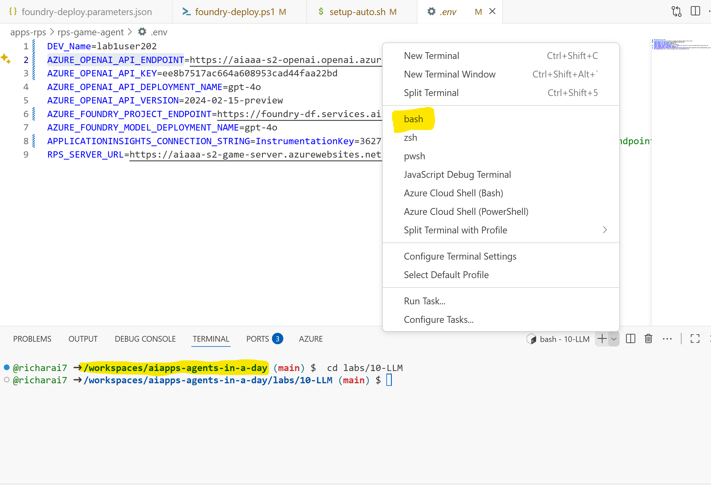
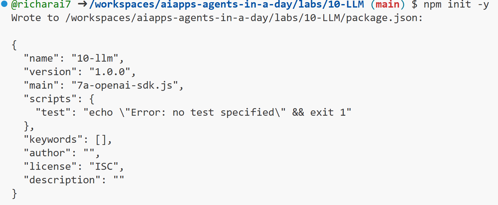

# Azure OpenAI SDK

:::tip Azure OpenAI SDK
Azure OpenAI SDK is a set of libraries that allow you to interact with Azure OpenAI services from your code. The SDK is available for multiple programming languages, including Python, Node.js, and C#.
:::

In this lab, you will learn how to use the Azure OpenAI SDK to interact with Azure OpenAI services from your code using Node.js.

## Setup Node.js project

1. Open a new `Terminal` window in Codespace. 

2. Go to a lab directory `labs/10-LLM/` 

  ```bash
  cd labs/10-LLM/
  ```
  

3. Run the following command to create a new Node.js project:

  ```bash
  npm init -y
  ```
  

4. When integrating Azure OpenAI service in a solution written in Node.js, the OpenAI NPM client library is used.
   Install the latest openai client library using `npm`:

  ```bash
  npm install @azure/openai@1.0.0-beta.11
  ```

5. Locate `10-LLM` folder in VS Code `Explorer`. Open `7a-openai-sdk.js` file to add code.

6. Then add the following variable definition to the `7a-openai-sdk.js` file using `require` to use the OpenAI library. Create the Azure OpenAI client to call the Azure OpenAI Chat completion API. Have a look at Azure OpenAI service endpoint and Azure OpenAI service key in the code below. Please copy below Javascript code into `7a-openai-sdk.js` below earlier block.

```javascript
const { OpenAIClient, AzureKeyCredential } = require("@azure/openai");

const client = new OpenAIClient(
  "https://<AZURE_OPENAI_API_INSTANCE_NAME>.openai.azure.com/",
  new AzureKeyCredential("<AZURE_OPENAI_API_KEY>")
);
```

7. Please edit the placeholder string to the right value. Azure OpenAI service endpoint is in the format of `https://<AZURE_OPENAI_API_INSTANCE_NAME>.openai.azure.com/`, for example, `https://aiaaa-s2-openai.openai.azure.com/`. Please find the configuration value on https://aiaaa-s2-setting.azurewebsites.net, or refer to `Lab Setup` step.

8. Once the Azure OpenAI client has been created, the next step is to call the `.getCompletions` method on the client to perform a chat completion. And print the response from Azure OpenAI to the console.

```javascript
// Block Reference 1
const chatResponse = client.getChatCompletions("gpt-4o", [
  { role: "user", content: "What are the different types of road bikes?" },
]);

// Block Reference 2
chatResponse
  .then((result) => {
    for (const choice of result.choices) {
      console.log(choice.message.content);
    }
  })
  .catch((err) => console.log(`Error: ${JSON.stringify(err)}`));
```

9. Open terminal window in VS code, and run below command. You should see the response from the Azure OpenAI service in the console.

```
node 7a-openai-sdk.js
```

Try the other examples in the next sections to see how you can interact with Azure OpenAI models from your code.

## System Message

You can set the system message to provide context to the conversation. The system message can be set using the `role: "system"`. If you see an error saying `variable already exists or defined`, please replace the previous code block `Block Reference 1` with new code block below.

```javascript
// Block Reference 1
const chatResponse = client.getChatCompletions("gpt-4o", [
  {
    role: "system",
    content:
      "You are a helpful, fun and friendly sales assistant for Contoso Bike Store, a bicycle and bicycle accessories store.",
  },
  { role: "user", content: "Do you sell bicycles?" },
]);
```

## Conversation History

You can send previous chat history to the model as part of the conversation. This can help the model provide more accurate responses. Replace the previous code block `Block Reference 1` in earlier step with new code block below.

```javascript
// Block Reference 1
const chatResponse = client.getChatCompletions("gpt-4o", [
  {
    role: "system",
    content:
      "You are a helpful, fun and friendly sales assistant for Contoso Bike Store, a bicycle and bicycle accessories store.",
  },
  { role: "user", content: "Do you sell bicycles?" },
  {
    role: "assistant",
    content:
      "Yes, we do sell bicycles. What kind of bicycle are you looking for?",
  },
  {
    role: "user",
    content: "I'm not sure what I'm looking for. Could you help me decide?",
  },
]);
```

## Function Calling

You can call a function from the model to perform a specific task. The available functions are passed to the model. The model analyzes the conversation history and decides when and how to call the function. The model also extracts the required parameters for the function from the conversation history.

Locate and open `7b-openai-sdk-func-call.js` to study how to make a function call.  The model calls the `search_bike` function to retrieve bikes from the search index based on the location, company, and model of the bike. 

1. Now let's study the code, you don't need to copy and paste code into above file. Firstly, it defines a function call definition.

```javascript
const searchBikeStore = {
  name: "search_bike",
  description: "Retrieves bikes from the search index based",
  parameters: {
    type: "object",
    properties: {
      location: {
        type: "string",
        description: "The location of the store (i.e. Seattle, WA)",
      },
      company: {
        type: "string",
        description: "The company of the bike",
      },
      model: {
        type: "string",
        description: "The model of the bike",
      },
    },
    required: ["location"],
  },
};

const options = {
    tools: [
        {
            type: "function",
            function: searchBikeStore,
        },
    ],
};

```

2. Then it calls the chat completions API, by passing the `searchBikeStore` function. 

```javascript
// Block Reference 1
const chatResponse = client.getChatCompletions("gpt-4o", [
    {
        role: "system",
        content:
            "You are a helpful, fun and friendly sales assistant for Contoso Bike Store, a bicycle and bicycle accessories store.",
    },
    {
        role: "user",
        content:
            "I'm looking for a bike in Seattle store. Can you help me find a bike from Trek company and model Domane SLR 9?",
    },
], options);
```

3. The response message includes one or more `tool calls` that must be resolved via `tool messages`. The following function to handle the request from the model to invoke the function below `const chatResponse = client.getChatCompletions` code block.

```javascript
// Purely for convenience and clarity, this function handles tool call responses.
function applyToolCall({ function: call, id }) {
    if (call.name === "search_bike") {
        console.log('[applyToolCall] invoked');
        const { location, company, model } = JSON.parse(call.arguments);
        // In a real application, this would be a call an external service or database.
        return {
            role: "tool",
            content: `The bike from ${company} company and model ${model} is available in ${location} store.`,
            toolCallId: id,
        };
    }
    throw new Error(`Unknown tool call: ${call.name}`);
}
```

4. Print the final response from the tool call to the console. In some cases, you may need to send the response from the tool back to the model along with the original conversation history to get the final response. 

```javascript
// Block Reference 2
chatResponse
    .then(async (result) => {

        console.log('[chatResponse]:' + JSON.stringify(result));
        console.log('')
        console.log('[chatResponse][Message]:' + JSON.stringify(result.choices[0].message));
        console.log('')

        for (const choice of result.choices) {
            const responseMessage = choice.message;

            if (responseMessage?.role === "assistant") {
                const requestedToolCalls = responseMessage?.toolCalls;
                if (requestedToolCalls?.length) {
                    const toolCallResolutionMessages = [
                        responseMessage,
                        ...requestedToolCalls.map(applyToolCall),
                    ];

                    console.log('[toolCallResolutionMessages]:' + JSON.stringify(toolCallResolutionMessages));
                    console.log('')

                    const result = await client.getChatCompletions('completions', toolCallResolutionMessages);
                    console.log('[chatResponse_with_toolcall]:' + JSON.stringify(result));
                    console.log('')
                    console.log('[chatResponse_with_toolcall][Message]:' + JSON.stringify(result.choices[0].message));
                    console.log('')
                }
            }
        }
    })
    .catch((err) => console.log(`Error: ${JSON.stringify(err)}`));
```

5. Run below command to execute the code.

```
node 7b-openai-sdk-func-call.js
```


:::tip
Where do you think the actual `applyToolCall` execution is? on the server-side or client-side?
:::
