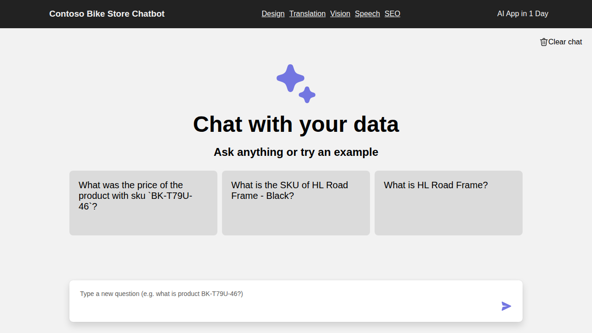
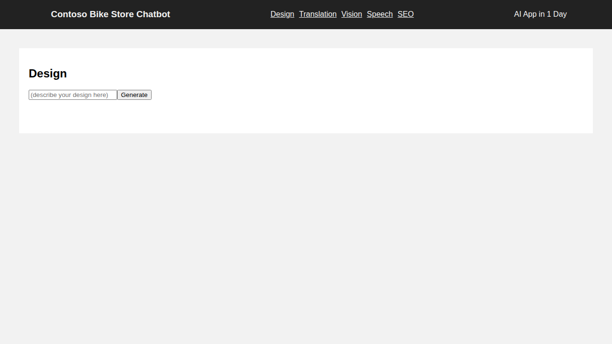
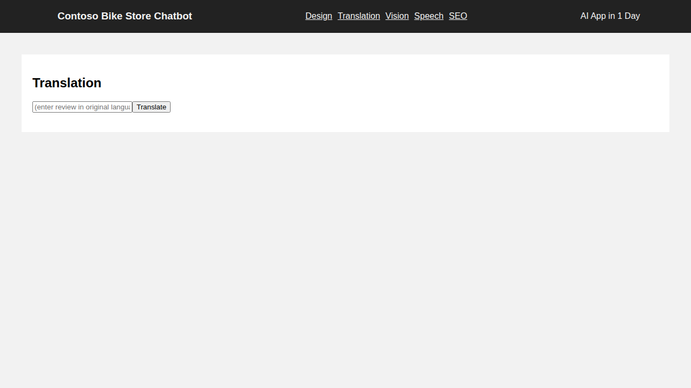

:::info LAB PRE-REQUISITES

- Access to the **AI Proxy Playground** (Use edge or chrome for the best experience)
- Azure OpenAI API Key
- VS Code
- Node.js and npm installed

:::

Welcome to the AI Apps Tutorial Series! In this comprehensive lab series, you'll learn to build practical AI-powered applications using Azure AI services. Each tutorial is designed as a guided, hands-on experience that builds real-world skills applicable to modern enterprise scenarios.

## Understanding Azure AI Services

Azure AI services represent a comprehensive suite of pre-built AI capabilities that enable developers to integrate advanced AI functionality into applications without requiring deep machine learning expertise. These services abstract the complexity of AI model development and deployment, allowing you to focus on creating business value.

### Core AI Service Categories

**🧠 Language AI Services**
- **Azure OpenAI Service**: Access to powerful language models (GPT-4, GPT-3.5) for text generation, conversation, and reasoning
- **Azure Translator**: Real-time text translation across 100+ languages
- **Text Analytics**: Sentiment analysis, key phrase extraction, and language detection

**👁️ Vision AI Services**  
- **Computer Vision**: Image analysis, object detection, and OCR capabilities
- **Custom Vision**: Train custom image classification and object detection models
- **Face API**: Face detection, recognition, and emotion analysis

**🗣️ Speech AI Services**
- **Speech to Text**: Convert spoken language to text with high accuracy
- **Text to Speech**: Generate natural-sounding speech from text
- **Speech Translation**: Real-time speech translation

**🎯 Decision AI Services**
- **Anomaly Detector**: Identify unusual patterns in time-series data
- **Content Moderator**: Detect potentially offensive or unwanted content
- **Personalizer**: Create personalized user experiences

## What You'll Build

Through six comprehensive tutorials, you'll create AI applications that demonstrate real-world business scenarios:

1. **🎨 Design Generation with DALL-E** - Create visual concepts and product designs using AI-generated imagery
2. **🌐 Translation Services** - Build multilingual customer support systems for global businesses
3. **👁️ Computer Vision Analysis** - Implement intelligent image processing for quality control and content analysis
4. **🗣️ Speech Processing** - Add voice capabilities and accessibility features to your applications
5. **🔍 SEO Content Generation** - Automate content creation and optimization for digital marketing
6. **🤖 Smart Automation** - Build intelligent workflow systems using function calling and orchestration

### Business Value and Use Cases

Each tutorial addresses specific business challenges:

- **Retail & E-commerce**: Product design, multilingual support, inventory management through vision
- **Manufacturing**: Quality control through computer vision, automated documentation
- **Healthcare**: Accessibility through speech services, document processing
- **Marketing**: Content generation, SEO optimization, social media automation
- **Customer Service**: Multilingual support, automated ticket processing, voice interfaces

## Tutorial Structure

Each tutorial follows a consistent structure:
- **Learning Objectives** - Clear goals for what you'll achieve
- **Scenario** - Real-world business context
- **Step-by-Step Implementation** - Guided coding experience
- **Solution Reference** - Complete working code examples
- **Best Practices** - Production-ready considerations
- **Integration Ideas** - Ways to extend and combine features

## AI Proxy Playground Setup

The AI Proxy Playground is a sophisticated web-based interface built on top of Azure OpenAI Service that provides hands-on experience with AI APIs. This custom playground helps you understand how to integrate AI services into applications through a user-friendly interface.

**AI Proxy Playground:** https://arg-syd-aiaaa-playground.azurewebsites.net

### Understanding the Playground Architecture

The playground acts as a proxy layer between your learning environment and Azure AI services, providing:
- **Centralized Authentication**: Single API key for multiple AI services
- **Usage Monitoring**: Track your API consumption and costs
- **Content Safety**: Built-in filtering and safety mechanisms
- **Rate Limiting**: Protection against excessive usage
- **Cross-Origin Support**: Enables browser-based API calls

### Authentication Process

1. **Navigate to the Playground**: Use the link provided during workshop registration
2. **Locate the API Key Field**: Found in the top-right corner of the interface
3. **Enter Your API Key**: This key provides access to all configured AI services
4. **Click Authorize**: Validates your credentials and establishes the session
5. **Verify Connection**: Look for the green indicator showing successful authentication

### Interface Overview and Features

Once authenticated, you'll see a comprehensive interface with these key regions:

#### **Region 1️⃣: User Profile and Session Management**
- **Session Information**: Current user, session duration, and usage statistics
- **Model Selection**: Choose between different AI models (GPT-4o, GPT-3.5-turbo, DALL-E 3)
- **Quick Actions**: Clear chat, export conversations, and session management

#### **Region 2️⃣: Prompt Input and User Interaction**
- **Rich Text Editor**: Enhanced input with syntax highlighting and formatting
- **File Upload**: Support for images, documents, and other media types
- **Voice Input**: Speech-to-text capabilities for natural interaction
- **Template Library**: Pre-built prompts for common scenarios

#### **Region 3️⃣: Conversation and Response Area**
- **Real-time Streaming**: See AI responses as they're generated
- **Response Formatting**: Syntax highlighting for code, markdown rendering
- **Copy/Export Functions**: Easy sharing and documentation of results
- **Response Analytics**: Token usage, response time, and quality metrics

#### **Region 4️⃣: Model Configuration Panel**
- **Temperature Control**: Adjust creativity vs. consistency (0.0 - 1.0)
- **Max Tokens**: Set response length limits
- **Top-p Sampling**: Fine-tune response diversity
- **Frequency/Presence Penalty**: Control repetition and topic focus

#### **Region 5️⃣: System Message Configuration**
- **Role Definition**: Set the AI's personality and expertise
- **Context Setting**: Provide background information and constraints
- **Behavior Guidelines**: Define response style and format preferences
- **Safety Instructions**: Additional content safety measures

#### **Region 6️⃣: Function Calling Setup**
- **Available Functions**: Browse and configure callable functions
- **Function Definitions**: JSON schema for function parameters
- **Execution Logs**: Monitor function calls and responses
- **Custom Functions**: Add your own business logic functions

#### **Region 7️⃣: Image Generation (DALL-E) Playground**
- **Style Controls**: Artistic style, resolution, and quality settings
- **Prompt Engineering**: Specialized controls for image generation
- **Generation History**: Browse and reuse previous image generations
- **Batch Processing**: Generate multiple variations simultaneously

### Best Practices for Playground Usage

#### **Effective Prompt Engineering**
```
Example: Instead of "Translate text"
Use: "Translate the following customer feedback from Spanish to English, maintaining the emotional tone and cultural context: [customer text]"
```

#### **Model Selection Guidelines**
- **GPT-4o**: Best for complex reasoning, analysis, and vision tasks
- **GPT-3.5-turbo**: Optimal for general conversation and simple tasks
- **DALL-E 3**: Exclusive for image generation and visual content

#### **Configuration Optimization**
- **Creative Tasks**: Higher temperature (0.7-0.9)
- **Factual Tasks**: Lower temperature (0.1-0.3)  
- **Balanced Tasks**: Medium temperature (0.4-0.6)

### Troubleshooting Common Issues

#### **Authentication Problems**
```bash
# Issue: "Unauthorized" or "Invalid API Key"
# Solution: 
1. Verify the API key is correctly copied (no extra spaces)
2. Check if the key has expired or been revoked
3. Ensure you're using the correct endpoint region
4. Contact workshop facilitator for key verification
```

#### **Network Connectivity**
```bash
# Issue: "Network Error" or "Connection Timeout"
# Solution:
1. Check your internet connection
2. Disable VPN if active
3. Try a different browser or incognito mode
4. Clear browser cache and cookies
```

#### **Rate Limiting**
```bash
# Issue: "Rate limit exceeded" or "Too many requests"
# Solution:
1. Wait for the rate limit window to reset (usually 1 minute)
2. Reduce the frequency of requests
3. Use smaller batch sizes for bulk operations
4. Monitor the usage indicator in the playground
```

#### **Content Safety Blocks**
```bash
# Issue: "Content filtered" or "Policy violation"
# Solution:
1. Review Azure's content policy guidelines
2. Rephrase prompts to avoid sensitive topics
3. Use more neutral language and contexts
4. Contact facilitator if you believe the filtering is incorrect
```

## Architecture Overview

### Application Architecture

The AI Apps tutorial series uses a modern, scalable architecture that demonstrates production-ready patterns:

```
┌─────────────────┐    ┌──────────────────┐    ┌─────────────────┐
│   React Frontend │ ── │  Azure AI Proxy  │ ── │ Azure AI Services│
│   (Vite + TS)   │    │   Playground     │    │                 │
└─────────────────┘    └──────────────────┘    └─────────────────┘
         │                       │                       │
         │              ┌─────────────────┐              │
         └──────────────│  REST APIs      │──────────────┘
                        │  (Direct calls) │
                        └─────────────────┘
```

**Frontend Layer**: React application with TypeScript for type safety and modern development experience
**API Layer**: Azure AI Proxy for centralized access control and the ability to make direct API calls
**AI Services Layer**: Various Azure AI services (OpenAI, Translator, Speech, Computer Vision)

### Security & Authentication

- **API Key Management**: Secure credential handling through environment variables
- **CORS Configuration**: Proper cross-origin resource sharing setup
- **Rate Limiting**: Built-in protection against API abuse
- **Content Safety**: Azure's built-in content filtering and safety mechanisms

### Development Environment Setup

#### Prerequisites Check

Ensure you have the following installed:

```bash
# Check Node.js version (should be 16+ for optimal compatibility)
node --version

# Check npm version (should be 8+)
npm --version

# Verify VS Code installation
code --version

# Optional: Check if Git is available for version control
git --version
```

#### Environment Configuration

1. **Clone the Repository** (if not already done):
```bash
git clone <repository-url>
cd aiapps-agents-in-a-day
```

2. **Navigate to the Chatbot Application**:
```bash
cd apps-chat/chatbot
```

3. **Install Dependencies**:
```bash
# Install all required packages
npm install

# Verify installation
npm list --depth=0
```

4. **Environment Variables Setup**:
Create a `.env` file in the chatbot directory:
```env
# Azure OpenAI Configuration
VITE_AZURE_OPENAI_ENDPOINT=your-endpoint-here
VITE_AZURE_OPENAI_API_KEY=your-api-key-here

# Azure Translator Configuration  
VITE_AZURE_TRANSLATOR_KEY=your-translator-key-here
VITE_AZURE_TRANSLATOR_REGION=your-region-here

# Azure Speech Configuration
VITE_AZURE_SPEECH_KEY=your-speech-key-here
VITE_AZURE_SPEECH_REGION=your-speech-region-here
```

#### Running the Application

```bash
# Start the development server
npm run dev

# Or for production build testing
npm run build
npm run preview
```

The application will be available at `http://localhost:3000` with individual tutorial pages for each AI feature.

#### Development Tools Integration

**VS Code Extensions** (Recommended):
- Azure Account
- Azure Resources  
- REST Client
- TypeScript Importer
- ES7+ React/Redux/React-Native snippets

**Browser Developer Tools**:
- Use Network tab to inspect API calls
- Console for debugging AI responses
- Application tab for local storage inspection

## Learning Paths and Prerequisites

### Recommended Learning Progression

#### **🟢 Beginner Path (No AI Experience)**
1. **Start Here**: Complete the Getting Started guide thoroughly
2. **Foundation**: Tutorial 1 (Design) - Learn basic AI API interaction
3. **Build Skills**: Tutorial 2 (Translation) - Understand REST API patterns
4. **Expand**: Tutorial 3 (Vision) - Explore multi-modal AI
5. **Advanced**: Continue with remaining tutorials based on interest

#### **🟡 Intermediate Path (Some Programming Experience)**
1. **Quick Start**: Skim Getting Started, focus on setup
2. **Jump In**: Any tutorial based on business needs
3. **Cross-Integrate**: Try combining features from multiple tutorials
4. **Customize**: Modify examples for your specific use cases

#### **🔴 Advanced Path (Experienced Developers)**
1. **Architecture Review**: Study the technical implementation patterns
2. **Production Focus**: Emphasize security, error handling, and scalability
3. **Integration Challenges**: Build comprehensive solutions using multiple services
4. **Optimization**: Focus on performance, cost, and monitoring

### Prerequisites Knowledge Matrix

| Tutorial | JavaScript/TypeScript | REST APIs | Azure Basics | AI Concepts |
|----------|---------------------|-----------|--------------|-------------|
| Design (DALL-E) | ⭐⭐ | ⭐ | ⭐ | ⭐ |
| Translation | ⭐⭐ | ⭐⭐ | ⭐ | ⭐ |
| Vision | ⭐⭐⭐ | ⭐⭐ | ⭐⭐ | ⭐⭐ |
| Speech | ⭐⭐⭐ | ⭐⭐ | ⭐⭐ | ⭐⭐ |
| SEO/Content | ⭐⭐⭐ | ⭐⭐⭐ | ⭐⭐ | ⭐⭐⭐ |
| Automation | ⭐⭐⭐⭐ | ⭐⭐⭐ | ⭐⭐⭐ | ⭐⭐⭐ |

*⭐ = Basic understanding helpful | ⭐⭐⭐⭐ = Advanced knowledge recommended*

### Tutorial Navigation Strategies

#### **Scenario-Based Learning**
Choose tutorials based on your business domain:

**🏪 Retail & E-commerce**
- Primary: Design → Vision → Translation
- Secondary: Speech → SEO → Automation
- Focus: Customer experience and global reach

**🏭 Manufacturing & Quality Control**  
- Primary: Vision → Automation → SEO
- Secondary: Translation → Speech → Design
- Focus: Process optimization and quality assurance

**🏥 Healthcare & Accessibility**
- Primary: Speech → Vision → Translation  
- Secondary: Automation → SEO → Design
- Focus: Accessibility and patient experience

**📈 Marketing & Content**
- Primary: SEO → Design → Translation
- Secondary: Speech → Vision → Automation  
- Focus: Content creation and audience engagement

#### **Technical Skill Building**
Progress through increasing complexity:

1. **API Integration Mastery**: Design → Translation → Vision
2. **Multi-modal AI**: Vision → Speech → Design
3. **Advanced Orchestration**: Automation → SEO → Integration

## Success Strategies and Best Practices

### 1. **Effective Model Selection**

Different tutorials use different AI models optimized for specific tasks:

#### **GPT-4o (Multi-modal)**
- **Best for**: Vision analysis, complex reasoning, conversation
- **Use in**: Vision tutorial, advanced automation scenarios
- **Settings**: Temperature 0.1-0.3 for factual tasks, 0.7-0.9 for creative tasks

#### **GPT-3.5-turbo**  
- **Best for**: General conversation, simple automation, quick responses
- **Use in**: Basic automation, simple content generation
- **Settings**: Balanced temperature around 0.5-0.7

#### **DALL-E 3**
- **Best for**: Image generation, visual design, creative content
- **Use in**: Design tutorial, marketing materials
- **Settings**: Focus on detailed prompts and style specifications

#### **Azure Translator**
- **Best for**: Text translation, language detection
- **Use in**: Translation tutorial, global content support
- **Settings**: Consider confidence scores and regional variations

#### **Azure Speech Services**
- **Best for**: Text-to-speech, speech-to-text, voice customization
- **Use in**: Speech tutorial, accessibility features
- **Settings**: Choose appropriate voice models and speaking rates

### 2. **Development Best Practices**

#### **Session Management**
```javascript
// Clear chat sessions between different tutorial exercises
// This ensures clean results and prevents context bleeding
clearChatSession();

// Use console.log to debug API responses
console.log('API Response:', response);
```

#### **Error Handling Patterns**
```javascript
try {
  const result = await aiService.callAPI(prompt);
  return result;
} catch (error) {
  if (error.code === 'ContentFiltered') {
    // Handle content safety issues
    return 'Content was filtered for safety reasons';
  } else if (error.code === 'RateLimited') {
    // Handle rate limiting
    return 'Please wait a moment and try again';
  }
  // Log unexpected errors for debugging
  console.error('Unexpected error:', error);
  throw error;
}
```

#### **Code Organization**
```javascript
// Separate API calls from UI logic
const apiService = {
  async generateImage(prompt) { /* DALL-E logic */ },
  async translateText(text) { /* Translation logic */ },
  async analyzeImage(image) { /* Vision logic */ }
};

// Use consistent naming and structure
const [loading, setLoading] = useState(false);
const [result, setResult] = useState('');
const [error, setError] = useState(null);
```

### 3. **Testing and Validation**

#### **Incremental Testing Strategy**
1. **Test each function** as you implement it
2. **Use simple inputs** before trying complex scenarios  
3. **Verify API connections** before building UI components
4. **Test edge cases** like empty inputs, long text, large images

#### **Validation Checklist**
- [ ] API keys are correctly configured
- [ ] Network requests complete successfully
- [ ] Responses are properly parsed
- [ ] UI updates reflect API results
- [ ] Error states are handled gracefully
- [ ] Loading states provide user feedback

### 4. **Performance Optimization**

#### **API Efficiency**
```javascript
// Debounce user input to reduce API calls
const debouncedAPICall = useMemo(
  () => debounce(apiService.processText, 500),
  []
);

// Cache frequent requests
const cache = new Map();
const cachedAPICall = async (key, apiFunction) => {
  if (cache.has(key)) return cache.get(key);
  const result = await apiFunction();
  cache.set(key, result);
  return result;
};
```

#### **Resource Management**
- **Image Optimization**: Resize images before processing
- **Batch Operations**: Group multiple requests when possible
- **Memory Management**: Clear large objects after use
- **Network Efficiency**: Use appropriate timeout values

### 5. **Security Considerations**

#### **API Key Protection**
```javascript
// Never commit API keys to version control
// Use environment variables in production
const API_KEY = process.env.REACT_APP_AZURE_OPENAI_KEY;

// Validate inputs before sending to APIs
const sanitizeInput = (input) => {
  return input.trim().substring(0, 1000); // Limit length
};
```

#### **Content Validation**
```javascript
// Implement client-side content checking
const validateContent = (content) => {
  // Check for appropriate content before API calls
  if (content.length < 1 || content.length > 4000) {
    throw new Error('Content length must be between 1 and 4000 characters');
  }
  return true;
};
```

## Application Screenshots

### Main Chatbot Interface
The application provides a clean, modern interface with navigation to all AI tutorial features:



*The main interface shows example queries and provides access to all tutorial features through the navigation bar.*

### Tutorial Pages
Each tutorial has its own dedicated page with specific UI elements for the AI service:

#### Design Tutorial (DALL-E Image Generation)


#### Translation Tutorial (Azure Translator)


#### Vision Tutorial (GPT-4o with Vision)


*Each page is optimized for its specific AI service with appropriate input controls and display areas.*

## What's Next?

Ready to start building? Head to **Tutorial 1: Product Design with DALL-E** to begin your AI app development journey!

Each tutorial builds practical skills you can apply immediately in real-world projects. By the end of this series, you'll have a comprehensive understanding of how to integrate multiple AI services into production applications.

---

:::tip REMEMBER
- Keep your API keys secure
- Test thoroughly before deploying
- Consider rate limits and costs
- Build with user experience in mind
:::
