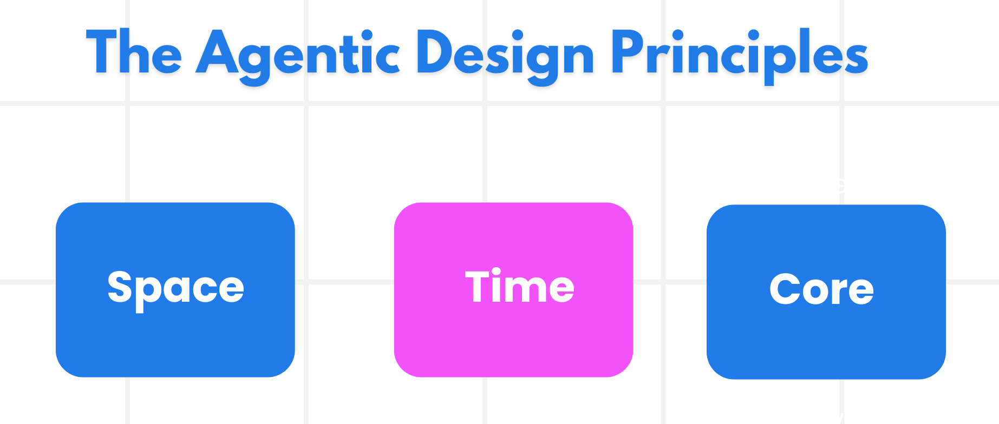

# AI Agentic Design Principles

## Introduction

There are many ways to think about building AI Agentic Systems. Given that ambiguity is a feature and not a bug in Generative AI design, it’s sometimes difficult for engineers to figure out where to even start. We have created a set of human-centric UX Design Principles to enable developers to build customer-centric agentic systems to solve their business needs. These design principles are not a prescriptive architecture but rather a starting point for teams who are defining and building out agent experiences.

In general, agents should:

- Broaden and scale human capacities (brainstorming, problem-solving, automation, etc.)
- Fill in knowledge gaps (get me up-to-speed on knowledge domains, translation, etc.)
- Facilitate and support collaboration in the ways we as individuals prefer to work with others
- Make us better versions of ourselves (e.g., life coach/task master, helping us learn emotional regulation and mindfulness skills, building resilience, etc.)

## The Agentic Design Principles



### Agent (Space)

This is the environment in which the agent operates. These principles inform how we design agents for engaging in physical and digital worlds.

- **Connecting, not collapsing** – help connect people to other people, events, and actionable knowledge to enable collaboration and connection.
- Agents help connect events, knowledge, and people.
- Agents bring people closer together. They are not designed to replace or belittle people.
- **Easily accessible yet occasionally invisible** – agent largely operates in the background and only nudges us when it is relevant and appropriate.
  - Agent is easily discoverable and accessible for authorized users on any device or platform.
  - Agent supports multimodal inputs and outputs (sound, voice, text, etc.).
  - Agent can seamlessly transition between foreground and background; between proactive and reactive, depending on its sensing of user needs.
  - Agent may operate in invisible form, yet its background process path and collaboration with other Agents are transparent to and controllable by the user.

### Agent (Time)

This is how the agent operates over time. These principles inform how we design agents interacting across the past, present, and future.

- **Past**: Reflecting on history that includes both state and context.
  - Agent provides more relevant results based on analysis of richer historical data beyond only the event, people, or states.
  - Agent creates connections from past events and actively reflects on memory to engage with current situations.
- **Now**: Nudging more than notifying.
  - Agent embodies a comprehensive approach to interacting with people. When an event happens, the Agent goes beyond static notification or other static formality. Agent can simplify flows or dynamically generate cues to direct the user’s attention at the right moment.
  - Agent delivers information based on contextual environment, social and cultural changes and tailored to user intent.
  - Agent interaction can be gradual, evolving/growing in complexity to empower users over the long term.
- **Future**: Adapting and evolving.
  - Agent adapts to various devices, platforms, and modalities.
  - Agent adapts to user behavior, accessibility needs, and is freely customizable.
  - Agent is shaped by and evolves through continuous user interaction.

### Agent (Core)

These are the key elements in the core of an agent’s design.

- **Embrace uncertainty but establish trust**.
  - A certain level of Agent uncertainty is expected. Uncertainty is a key element of agent design.
  - Trust and transparency are foundational layers of Agent design.
  - Humans are in control of when the Agent is on/off and Agent status is clearly visible at all times.

## The Guidelines to Implement These Principles

When you’re using the previous design principles, use the following guidelines:

1. **Transparency**: Inform the user that AI is involved, how it functions (including past actions), and how to give feedback and modify the system.
2. **Control**: Enable the user to customize, specify preferences and personalize, and have control over the system and its attributes (including the ability to forget).
3. **Consistency**: Aim for consistent, multi-modal experiences across devices and endpoints. Use familiar UI/UX elements where possible (e.g., microphone icon for voice interaction) and reduce the customer’s cognitive load as much as possible (e.g., aim for concise responses, visual aids, and ‘Learn More’ content).

## How To Design an Agent using These Principles and Guidelines

Imagine you are designing a Rock Paper Scissors Agent, here is how you could think about using the Design Principles and Guidelines:

1. **Transparency** – Let the user know that the Rock Paper Scissors Agent is an AI-enabled Agent. Provide clear instructions on how to participate in tournaments (e.g., registration process, game rules explanation). Show the tournament bracket and current standings. Make it clear how players can view their game history and provide feedback on match results. Clearly communicate tournament rules, scoring system, and when results will be revealed.

2. **Control** – Enable players to customize their gameplay strategy preferences and view their complete match history. Allow players to opt out of tournaments, delete their participation data, and control notifications about game status. Provide clear options for players to modify their registration information and game preferences.

3. **Consistency** – Use recognizable gaming icons for rock, paper, and scissors moves. Implement familiar tournament bracket visualizations and leaderboard displays. Use standard gaming UI elements like "Start Tournament", "Submit Move", and progress indicators. Maintain consistent visual feedback for wins, losses, and ties across all game interfaces.


## Create AI Agent Service Agent via Code

- navigate to `labs/40-AIAgents` folder, open `game_agent_v2_llm.py` file.

```python
cd labs/40-AIAgents
```

- install python packages. all required packages are listed in `requirements.txt` file. they are for all the labs in this module.

```python
pip install -r requirements.txt
```

- the SDK talks to Azure AI Agent Service via managed identity to ensure the security of the service. You will need to sign in to Azure in the terminial windows first. Sign in with the same identity that has access to the Azure AI Agent Service resource, it should be a DEV1XX@aiapps.top account.

```powershell
az login --tenant <your-tenant-id>
```

- run the agent and see the console output.

```python
python game_agent_v2_llm.py
```
// add screenshot of console output

- navigate to Azure AI Foundry portal, you should see the agent created in the portal.

- you can also interact with the agent in the portal playground.

