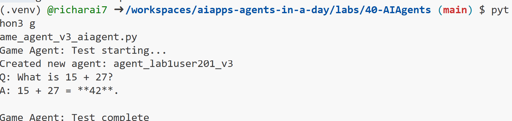

# Azure AI Agent Service

Azure AI Agent Service is a more recent addition, introduced at Microsoft Ignite 2024. It allows for the development and deployment of AI agents with more flexible models, such as directly calling open-source LLMs like Llama 3, Mistral, and Cohere.

Azure AI Agent Service provides stronger enterprise security mechanisms and data storage methods, making it suitable for enterprise applications. 

It works out-of-the-box with multi-agent orchestration frameworks like AutoGen and Semantic Kernel. Using Semantic Kernel Python, we can create an Azure AI Agent with a user-defined plugin:

## Create AI Agent Service Agent

- navigate to `labs/40-AIAgents` folder, open `game_agent_v3_aiagent.py` file.

```python
cd labs/40-AIAgents
```

- run the agent and see the console output.

```python
python game_agent_v3_aiagent.py
```


- navigate to Azure AI Foundry portal, you should see the agent created in the portal.

- you can also interact with the agent in the portal playground.


## AI Agent Service Core Concepts

Azure AI Agent Service has the following core concepts:

### Agent

Azure AI Agent Service integrates with Azure AI Foundry. Within AI Foundry, an AI Agent acts as a "smart" microservice that can be used to answer questions (RAG), perform actions, or completely automate workflows. It achieves this by combining the power of generative AI models with tools that allow it to access and interact with real-world data sources. Here's an example of an agent:

    ```python
    agent = project_client.agents.create_agent(
        model="gpt-4o-mini",
        name="my-agent",
        instructions="You are helpful agent",
        tools=code_interpreter.definitions,
        tool_resources=code_interpreter.resources,
    )
    ```

    In this example, an agent is created with the model `gpt-4o-mini`, a name `my-agent`, and instructions `You are helpful agent`. The agent is equipped with tools and resources to perform code interpretation tasks.

### Thread and messages

The thread is another important concept. It represents a conversation or interaction between an agent and a user. Threads can be used to track the progress of a conversation, store context information, and manage the state of the interaction. Here's an example of a thread:

    ```python
    thread = project_client.agents.create_thread()
    message = project_client.agents.create_message(
        thread_id=thread.id,
        role="user",
        content="Could you please create a bar chart for the operating profit using the following data and provide the file to me? Company A: $1.2 million, Company B: $2.5 million, Company C: $3.0 million, Company D: $1.8 million",
    )
    
    # Ask the agent to perform work on the thread
    run = project_client.agents.create_and_process_run(thread_id=thread.id, agent_id=agent.id)
    
    # Fetch and log all messages to see the agent's response
    messages = project_client.agents.list_messages(thread_id=thread.id)
    print(f"Messages: {messages}")
    ```

    In the previous code, a thread is created. Thereafter, a message is sent to the thread. By calling `create_and_process_run`, the agent is asked to perform work on the thread. Finally, the messages are fetched and logged to see the agent's response. The messages indicate the progress of the conversation between the user and the agent. It's also important to understand that the messages can be of different types such as text, image, or file, that is the agents work has resulted in for example an image or a text response for example. As a developer, you can then use this information to further process the response or present it to the user.

### Integrates with other AI frameworks

 Azure AI Agent service can interact with other frameworks like AutoGen and Semantic Kernel, which means you can build part of your app in one of these frameworks and for example using the Agent service as an orchestrator or you can build everything in the Agent service.

**Use Cases**: Azure AI Agent Service is designed for enterprise applications that require secure, scalable, and flexible AI agent deployment.

