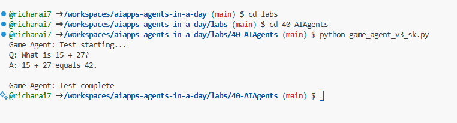

# Semantic Kernel + Agent Framework

Semantic Kernel is an enterprise-ready AI Orchestration SDK. It consists of AI and memory connectors, along with an Agent Framework.

Let's first cover some core components:


## Create Semantic Kernal Agent

- navigate to `labs/40-AIAgents` folder, open `game_agent_v3_sk.py` file.

```python
cd labs/40-AIAgents
```
- run the agent and see the console output.

```python
python game_agent_v3_sk.py
```



// add screenshot of console output
//TODO

- because the semantic kernal agent does not use a managed service, so you can't see it in the Azure AI Foundry portal.


## AI Connectors

This is an interface with external AI services and data sources for use in both Python and C#.

  ```python
  # Semantic Kernel Python
  from semantic_kernel.connectors.ai.open_ai import AzureChatCompletion
  from semantic_kernel.kernel import Kernel

  kernel = Kernel()
  kernel.add_service(
    AzureChatCompletion(
        deployment_name="your-deployment-name",
        api_key="your-api-key",
        endpoint="your-endpoint",
    )
  )
  ```  

    Here you have a simple example of how you can create a kernel and add a chat completion service. Semantic Kernel creates a connection to an external AI service, in this case, Azure OpenAI Chat Completion.

## Plugins

These encapsulate functions that an application can use. There are both ready-made plugins and custom ones you can create. A related concept is "prompt functions." Instead of providing natural language cues for function invocation, you broadcast certain functions to the model. Based on the current chat context, the model may choose to call one of these functions to complete a request or query. Here's an example:

  ```python
  from semantic_kernel.connectors.ai.open_ai.services.azure_chat_completion import AzureChatCompletion


  async def main():
      from semantic_kernel.functions import KernelFunctionFromPrompt
      from semantic_kernel.kernel import Kernel

      kernel = Kernel()
      kernel.add_service(AzureChatCompletion())

      user_input = input("User Input:> ")

      kernel_function = KernelFunctionFromPrompt(
          function_name="SummarizeText",
          prompt="""
          Summarize the provided unstructured text in a sentence that is easy to understand.
          Text to summarize: {{$user_input}}
          """,
      )

      response = await kernel_function.invoke(kernel=kernel, user_input=user_input)
      print(f"Model Response: {response}")

      """
      Sample Console Output:

      User Input:> I like dogs
      Model Response: The text expresses a preference for dogs.
      """


  if __name__ == "__main__":
    import asyncio
    asyncio.run(main())
  ```

    ```csharp
    var userInput = Console.ReadLine();

    // Define semantic function inline.
    string skPrompt = @"Summarize the provided unstructured text in a sentence that is easy to understand.
                        Text to summarize: {{$userInput}}";
    
    // create the function from the prompt
    KernelFunction summarizeFunc = kernel.CreateFunctionFromPrompt(
        promptTemplate: skPrompt,
        functionName: "SummarizeText"
    );

    //then import into the current kernel
    kernel.ImportPluginFromFunctions("SemanticFunctions", [summarizeFunc]);

    ```

    Here, you first have a template prompt `skPrompt` that leaves room for the user to input text, `$userInput`. Then you create the kernel function `SummarizeText` and then import it into the kernel with the plugin name `SemanticFunctions`. Note the name of the function that helps Semantic Kernel understand what the function does and when it should be called.

## Native function

There's also native functions that the framework can call directly to carry out the task. Here's an example of such a function retrieving the content from a file:

    ```csharp
    public class NativeFunctions {

        [SKFunction, Description("Retrieve content from local file")]
        public async Task<string> RetrieveLocalFile(string fileName, int maxSize = 5000)
        {
            string content = await File.ReadAllTextAsync(fileName);
            if (content.Length <= maxSize) return content;
            return content.Substring(0, maxSize);
        }
    }
    
    //Import native function
    string plugInName = "NativeFunction";
    string functionName = "RetrieveLocalFile";

   //To add the functions to a kernel use the following function
    kernel.ImportPluginFromType<NativeFunctions>();

    ```

## Memory

Abstracts and simplifies context management for AI apps. The idea with memory is that this is something the LLM should know about. You can store this information in a vector store which ends up being an in-memory database or a vector database or similar. Here's an example of a very simplified scenario where *facts* are added to the memory:

    ```csharp
    var facts = new Dictionary<string,string>();
    facts.Add(
        "Azure Machine Learning; https://learn.microsoft.com/azure/machine-learning/",
        @"Azure Machine Learning is a cloud service for accelerating and
        managing the machine learning project lifecycle. Machine learning professionals,
        data scientists, and engineers can use it in their day-to-day workflows"
    );
    
    facts.Add(
        "Azure SQL Service; https://learn.microsoft.com/azure/azure-sql/",
        @"Azure SQL is a family of managed, secure, and intelligent products
        that use the SQL Server database engine in the Azure cloud."
    );
    
    string memoryCollectionName = "SummarizedAzureDocs";
    
    foreach (var fact in facts) {
        await memoryBuilder.SaveReferenceAsync(
            collection: memoryCollectionName,
            description: fact.Key.Split(";")[1].Trim(),
            text: fact.Value,
            externalId: fact.Key.Split(";")[2].Trim(),
            externalSourceName: "Azure Documentation"
        );
    }
    ```

    These facts are then stored in the memory collection `SummarizedAzureDocs`. This is a very simplified example, but you can see how you can store information in the memory for the LLM to use.

## Agent Framework

So that's the basics of the Semantic Kernel framework, what about the Agent Framework? //todo
