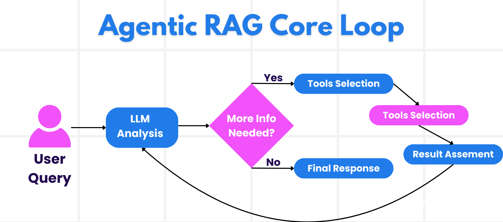
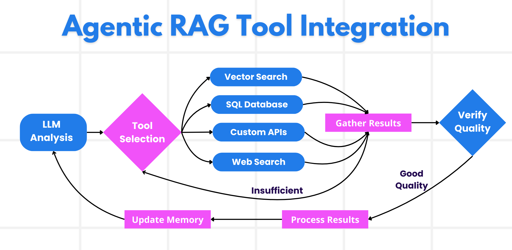
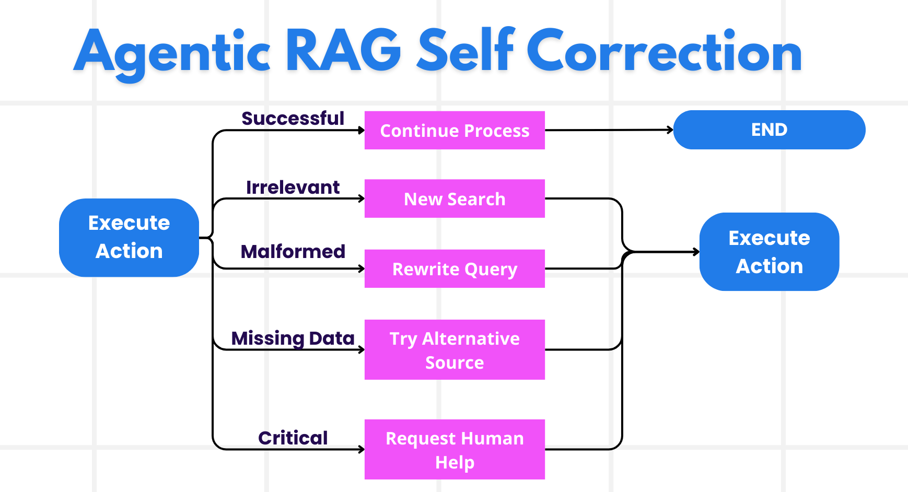

# Agentic RAG

//todo: for game agent, add RAG process, call it agent_v55.py in apps-rps/rps-game-agent. follow agent_v1.py

This lesson provides a comprehensive overview of Agentic Retrieval-Augmented Generation (Agentic RAG), an emerging AI paradigm where large language models (LLMs) autonomously plan their next steps while pulling information from external sources. Unlike static retrieval-then-read patterns, Agentic RAG involves iterative calls to the LLM, interspersed with tool or function calls and structured outputs. The system evaluates results, refines queries, invokes additional tools if needed, and continues this cycle until a satisfactory solution is achieved.

## What is Agentic RAG?

Agentic Retrieval-Augmented Generation (Agentic RAG) is an emerging AI paradigm where large language models (LLMs) autonomously plan their next steps while pulling information from external sources. Unlike static retrieval-then-read patterns, Agentic RAG involves iterative calls to the LLM, interspersed with tool or function calls and structured outputs. The system evaluates results, refines queries, invokes additional tools if needed, and continues this cycle until a satisfactory solution is achieved. This iterative “maker-checker” style improves correctness, handles malformed queries, and ensures high-quality results.

The system actively owns its reasoning process, rewriting failed queries, choosing different retrieval methods, and integrating multiple tools—such as vector search in Azure AI Search, SQL databases, or custom APIs—before finalizing its answer. The distinguishing quality of an agentic system is its ability to own its reasoning process. Traditional RAG implementations rely on pre-defined paths, but an agentic system autonomously determines the sequence of steps based on the quality of the information it finds.

## Defining Agentic Retrieval-Augmented Generation (Agentic RAG)

Agentic Retrieval-Augmented Generation (Agentic RAG) is an emerging paradigm in AI development where LLMs not only pull information from external data sources but also autonomously plan their next steps. Unlike static retrieval-then-read patterns or carefully scripted prompt sequences, Agentic RAG involves a loop of iterative calls to the LLM, interspersed with tool or function calls and structured outputs. At every turn, the system evaluates the results it has obtained, decides whether to refine its queries, invokes additional tools if needed, and continues this cycle until it achieves a satisfactory solution.

This iterative “maker-checker” style of operation is designed to improve correctness, handle malformed queries to structured databases (e.g. NL2SQL), and ensure balanced, high-quality results. Rather than relying solely on carefully engineered prompt chains, the system actively owns its reasoning process. It can rewrite queries that fail, choose different retrieval methods, and integrate multiple tools—such as vector search in Azure AI Search, SQL databases, or custom APIs—before finalizing its answer. This removes the need for overly complex orchestration frameworks. Instead, a relatively simple loop of “LLM call → tool use → LLM call → …” can yield sophisticated and well-grounded outputs.



## Owning the Reasoning Process

The distinguishing quality that makes a system “agentic” is its ability to own its reasoning process. Traditional RAG implementations often depend on humans pre-defining a path for the model: a chain-of-thought that outlines what to retrieve and when.
But when a system is truly agentic, it internally decides how to approach the problem. It’s not just executing a script; it’s autonomously determining the sequence of steps based on the quality of the information it finds.
For example, if it’s asked to answer a complex RPS tournament question and select an optimal move, it doesn’t rely solely on a prompt that spells out the entire research and decision-making workflow. Instead, the agentic model independently decides to:

1. Search its knowledge base for the specific question topic using vector search
2. Retrieve related contextual information using Azure AI Search to enhance accuracy 
3. Cross-reference multiple sources to validate the answer's correctness
4. Analyze opponent move patterns from tournament history using Azure SQL Database
5. Synthesize all findings to provide both an accurate answer and strategic move recommendation
6. Evaluate the confidence level and iterate if needed for tournament-critical decisions
All of these steps—refining queries, choosing sources, iterating until “happy” with the answer—are decided by the model, not pre-scripted by a human.

## Iterative Loops, Tool Integration, and Memory



An agentic system relies on a looped interaction pattern:

- **Initial Call:** The user’s goal (aka. user prompt) is presented to the LLM.
- **Tool Invocation:** If the model identifies missing information or ambiguous instructions, it selects a tool or retrieval method—like a vector database query (e.g. Azure AI Search Hybrid search over private data) or a structured SQL call—to gather more context.
- **Assessment & Refinement:** After reviewing the returned data, the model decides whether the information suffices. If not, it refines the query, tries a different tool, or adjusts its approach.
- **Repeat Until Satisfied:** This cycle continues until the model determines that it has enough clarity and evidence to deliver a final, well-reasoned response.
- **Memory & State:** Because the system maintains state and memory across steps, it can recall previous attempts and their outcomes, avoiding repetitive loops and making more informed decisions as it proceeds.

Over time, this creates a sense of evolving understanding, enabling the model to navigate complex, multi-step tasks without requiring a human to constantly intervene or reshape the prompt.

## Handling Failure Modes and Self-Correction

Agentic RAG’s autonomy also involves robust self-correction mechanisms. When the system hits dead ends—such as retrieving irrelevant documents or encountering malformed queries—it can:

- **Iterate and Re-Query:** Instead of returning low-value responses, the model attempts new search strategies, rewrites database queries, or looks at alternative data sets.
- **Use Diagnostic Tools:** The system may invoke additional functions designed to help it debug its reasoning steps or confirm the correctness of retrieved data. Tools like Azure AI Tracing will be important to enable robust observability and monitoring.
- **Fallback on Human Oversight:** For high-stakes or repeatedly failing scenarios, the model might flag uncertainty and request human guidance. Once the human provides corrective feedback, the model can incorporate that lesson going forward.

This iterative and dynamic approach allows the model to improve continuously, ensuring that it’s not just a one-shot system but one that learns from its missteps during a given session.



## Boundaries of Agency

Despite its autonomy within a task, Agentic RAG is not analogous to Artificial General Intelligence. Its “agentic” capabilities are confined to the tools, data sources, and policies provided by human developers. It can’t invent its own tools or step outside the domain boundaries that have been set. Rather, it excels at dynamically orchestrating the resources at hand.
Key differences from more advanced AI forms include:

1. **Domain-Specific Autonomy:** Agentic RAG systems are focused on achieving user-defined goals within a known domain, employing strategies like query rewriting or tool selection to improve outcomes.
2. **Infrastructure-Dependent:** The system’s capabilities hinge on the tools and data integrated by developers. It can’t surpass these boundaries without human intervention.
3. **Respect for Guardrails:** Ethical guidelines, compliance rules, and business policies remain very important. The agent’s freedom is always constrained by safety measures and oversight mechanisms (hopefully?)

## Practical Use Cases and Value

Agentic RAG shines in scenarios requiring iterative refinement and precision:

1. **Tournament Question Accuracy:** In RPS tournament settings where answer correctness is critical, the agentic model can repeatedly verify facts across multiple knowledge sources, cross-reference information, and rewrite queries until it produces a thoroughly vetted answer with high confidence.
2. **Strategic Move Optimization:** When dealing with structured data where queries might often fail or need adjustment, the system can autonomously refine its queries using Azure SQL or Microsoft Fabric OneLake, ensuring the final retrieval aligns with the user’s intent.
3. **Adaptive Tournament Performance:** Longer-running sessions might evolve as new information surfaces. Agentic RAG can continuously incorporate new data, shifting strategies as it learns more about the problem space.

## Governance, Transparency, and Trust

As these systems become more autonomous in their reasoning, governance and transparency are crucial:

- **Explainable Reasoning:** The model can provide an audit trail of the queries it made, the sources it consulted, and the reasoning steps it took to reach its conclusion. Tools like Azure AI Content Safety and Azure AI Tracing / GenAIOps can help maintain transparency and mitigate risks.
- **Bias Control and Balanced Retrieval:** Developers can tune retrieval strategies to ensure balanced, representative data sources are considered, and regularly audit outputs to detect bias or skewed patterns using custom models for advanced data science organizations using Azure Machine Learning.
- **Human Oversight and Compliance:** For sensitive tasks, human review remains essential. Agentic RAG doesn’t replace human judgment in high-stakes decisions—it augments it by delivering more thoroughly vetted options.

Having tools that provide a clear record of actions is essential. Without them, debugging a multi-step process can be very difficult. See the following example from Literal AI (company behind Chainlit) for an Agent run:


## Agentic RAG Example for Game Agent

Here's how an Agentic RAG system might work for a RPS tournament agent:

**Initial Query:** "Answer this tournament question: 'What is the chemical symbol for gold?' and recommend my next move for round 4."

**Agentic RAG Process:**
```
1. Initial Assessment
   - Question type: Chemistry/Science
   - Confidence needed: High (tournament critical)

2. Knowledge Retrieval Loop
   - Search vector database for "chemical symbols" + "gold"
   - Retrieve: Multiple sources confirm "Au" 
   - Cross-validate: Check periodic table references
   - Confidence: High (95%+)

3. Validation Loop
   - Verify answer accuracy against chemistry knowledge base
   - Check confidence thresholds met
   - Final decision: Proceed with submission

4. Response Synthesis
   - Answer: "Au" (confidence: 96%)
   - Ready for tournament submission
```

This demonstrates the key Agentic RAG principles:
- **Autonomous reasoning:** The system decided what sources to query and how to validate
- **Iterative refinement:** Multiple loops to ensure accuracy and strategy
- **Tool orchestration:** Combined knowledge retrieval, data analysis, and validation
- **Self-correction:** Would retry with different sources if confidence was low

```python
add knowledge base retrieval tool to game agent
```

## Conclusion

Agentic RAG represents a natural evolution in how AI systems handle complex, data-intensive tasks. By adopting a looped interaction pattern, autonomously selecting tools, and refining queries until achieving a high-quality result, the system moves beyond static prompt-following into a more adaptive, context-aware decision-maker. While still bounded by human-defined infrastructures and ethical guidelines, these agentic capabilities enable richer, more dynamic, and ultimately more useful AI interactions for both enterprises and end-users.
