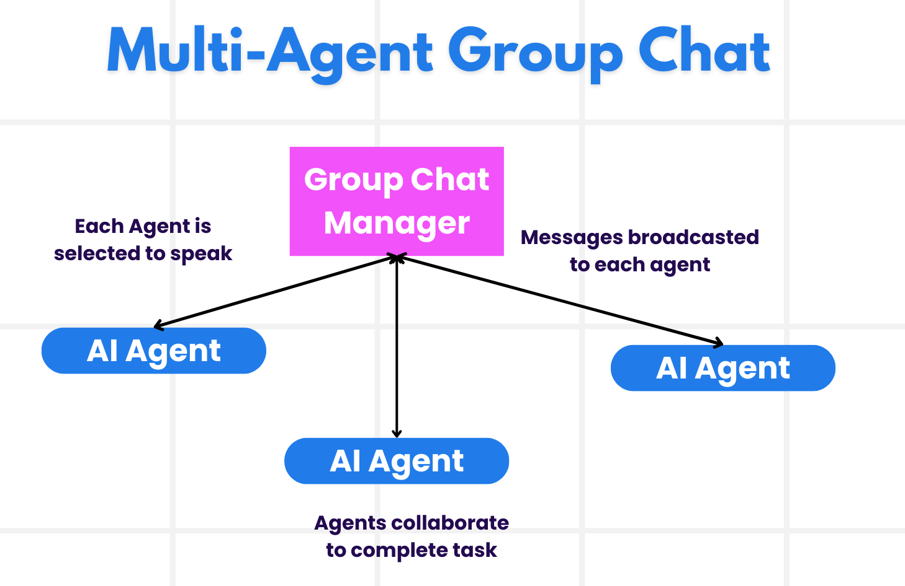
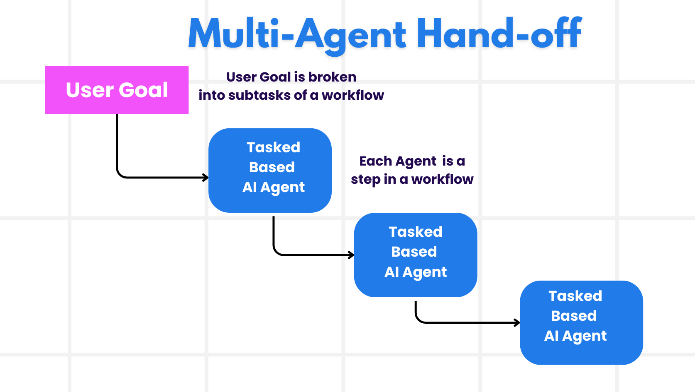
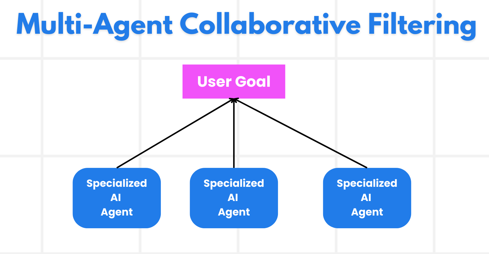
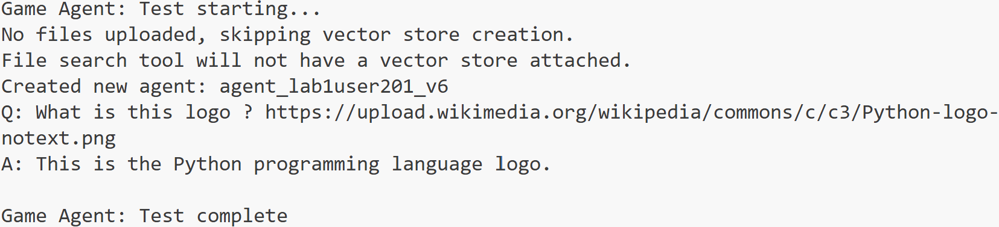

# Multi-agent Orchestration

As soon as you start working on a project that involves multiple agents, you will need to consider the multi-agent design pattern. However, it might not be immediately clear when to switch to multi-agents and what the advantages are.

## Scenarios Where Multi-Agents Are Applicable

So what scenarios are a good use case for using multi-agents? The answer is that there are many scenarios where employing multiple agents is beneficial especially in the following cases:

- **Large workloads**: Large workloads can be divided into smaller tasks and assigned to different agents, allowing for parallel processing and faster completion. An example of this is in the case of a large data processing task.
- **Complex tasks**: Complex tasks, like large workloads, can be broken down into smaller subtasks and assigned to different agents, each specializing in a specific aspect of the task. A good example of this is in the case of autonomous vehicles where different agents manage navigation, obstacle detection, and communication with other vehicles.
- **Diverse expertise**: Different agents can have diverse expertise, allowing them to handle different aspects of a task more effectively than a single agent. For this case, a good example is in the case of healthcare where agents can manage diagnostics, treatment plans, and patient monitoring.

## Advantages of Using Multi-Agents Over a Singular Agent

A single agent system could work well for simple tasks, but for more complex tasks, using multiple agents can provide several advantages:

- **Specialization**: Each agent can be specialized for a specific task. Lack of specialization in a single agent means you have an agent that can do everything but might get confused on what to do when faced with a complex task. It might for example end up doing a task that it is not best suited for.
- **Scalability**: It is easier to scale systems by adding more agents rather than overloading a single agent.
- **Fault Tolerance**: If one agent fails, others can continue functioning, ensuring system reliability.

Let's take an example, let's book a trip for a user. A single agent system would have to handle all aspects of the trip booking process, from finding flights to booking hotels and rental cars. To achieve this with a single agent, the agent would need to have tools for handling all these tasks. This could lead to a complex and monolithic system that is difficult to maintain and scale. A multi-agent system, on the other hand, could have different agents specialized in finding flights, booking hotels, and rental cars. This would make the system more modular, easier to maintain, and scalable.

Compare this to a travel bureau run as a mom-and-pop store versus a travel bureau run as a franchise. The mom-and-pop store would have a single agent handling all aspects of the trip booking process, while the franchise would have different agents handling different aspects of the trip booking process.

## Building Blocks of Implementing the Multi-Agent Design Pattern

Before you can implement the multi-agent design pattern, you need to understand the building blocks that make up the pattern.

Let's make this more concrete by again looking at the example of booking a trip for a user. In this case, the building blocks would include:

- **Agent Communication**: Agents for finding flights, booking hotels, and rental cars need to communicate and share information about the user's preferences and constraints. You need to decide on the protocols and methods for this communication. What this means concretely is that the agent for finding flights needs to communicate with the agent for booking hotels to ensure that the hotel is booked for the same dates as the flight. That means that the agents need to share information about the user's travel dates, meaning that you need to decide *which agents are sharing info and how they are sharing info*.
- **Coordination Mechanisms**: Agents need to coordinate their actions to ensure that the user's preferences and constraints are met. A user preference could be that they want a hotel close to the airport whereas a constraint could be that rental cars are only available at the airport. This means that the agent for booking hotels needs to coordinate with the agent for booking rental cars to ensure that the user's preferences and constraints are met. This means that you need to decide *how the agents are coordinating their actions*.
- **Agent Architecture**: Agents need to have the internal structure to make decisions and learn from their interactions with the user. This means that the agent for finding flights needs to have the internal structure to make decisions about which flights to recommend to the user. This means that you need to decide *how the agents are making decisions and learning from their interactions with the user*. Examples of how an agent learns and improves could be that the agent for finding flights could use a machine learning model to recommend flights to the user based on their past preferences.
- **Visibility into Multi-Agent Interactions**: You need to have visibility into how the multiple agents are interacting with each other. This means that you need to have tools and techniques for tracking agent activities and interactions. This could be in the form of logging and monitoring tools, visualization tools, and performance metrics.
- **Multi-Agent Patterns**: There are different patterns for implementing multi-agent systems, such as centralized, decentralized, and hybrid architectures. You need to decide on the pattern that best fits your use case.
- **Human in the loop**: In most cases, you will have a human in the loop and you need to instruct the agents when to ask for human intervention. This could be in the form of a user asking for a specific hotel or flight that the agents have not recommended or asking for confirmation before booking a flight or hotel.

## Visibility into Multi-Agent Interactions

It's important that you have visibility into how the multiple agents are interacting with each other. This visibility is essential for debugging, optimizing, and ensuring the overall system's effectiveness. To achieve this, you need to have tools and techniques for tracking agent activities and interactions. This could be in the form of logging and monitoring tools, visualization tools, and performance metrics.

For example, in the case of booking a trip for a user, you could have a dashboard that shows the status of each agent, the user's preferences and constraints, and the interactions between agents. This dashboard could show the user's travel dates, the flights recommended by the flight agent, the hotels recommended by the hotel agent, and the rental cars recommended by the rental car agent. This would give you a clear view of how the agents are interacting with each other and whether the user's preferences and constraints are being met.

Let's look at each of these aspects more in detail.

- **Logging and Monitoring Tools**: You want to have logging done for each action taken by an agent. A log entry could store information on the agent that took the action, the action taken, the time the action was taken, and the outcome of the action. This information can then be used for debugging, optimizing and more.

- **Visualization Tools**: Visualization tools can help you see the interactions between agents in a more intuitive way. For example, you could have a graph that shows the flow of information between agents. This could help you identify bottlenecks, inefficiencies, and other issues in the system.

- **Performance Metrics**: Performance metrics can help you track the effectiveness of the multi-agent system. For example, you could track the time taken to complete a task, the number of tasks completed per unit of time, and the accuracy of the recommendations made by the agents. This information can help you identify areas for improvement and optimize the system.

## Multi-Agent Patterns

Let's dive into some concrete patterns we can use to create multi-agent apps. Here are some interesting patterns worth considering:

### Group chat

This pattern is useful when you want to create a group chat application where multiple agents can communicate with each other. Typical use cases for this pattern include team collaboration, customer support, and social networking.

In this pattern, each agent represents a user in the group chat, and messages are exchanged between agents using a messaging protocol. The agents can send messages to the group chat, receive messages from the group chat, and respond to messages from other agents.

This pattern can be implemented using a centralized architecture where all messages are routed through a central server, or a decentralized architecture where messages are exchanged directly.



### Hand-off

This pattern is useful when you want to create an application where multiple agents can hand off tasks to each other.

Typical use cases for this pattern include customer support, task management, and workflow automation.

In this pattern, each agent represents a task or a step in a workflow, and agents can hand off tasks to other agents based on predefined rules.



### Collaborative filtering

This pattern is useful when you want to create an application where multiple agents can collaborate to make recommendations to users.

Why you would want multiple agents to collaborate is because each agent can have different expertise and can contribute to the recommendation process in different ways.

Let's take an example where a user wants a recommendation on the best stock to buy on the stock market.

- **Industry expert**:. One agent could be an expert in a specific industry.
- **Technical analysis**: Another agent could be an expert in technical analysis.
- **Fundamental analysis**: and another agent could be an expert in fundamental analysis. By collaborating, these agents can provide a more comprehensive recommendation to the user.



## Scenario: RPS Tournament Coordination

Consider a scenario where a RPS tournament is being organized and managed, there can be quite a few agents involved in this process but let's divide it up between agents specific for this tournament process and general agents that can be used in other gaming processes.

**Agents specific for the RPS tournament process**:

Following are some agents that could be involved in the tournament process:

- **Player agent**: This agent represents individual players and is responsible for participating in tournament rounds, answering questions, and selecting moves.
- **Referee agent**: This agent represents the tournament referee and is responsible for starting/ending rounds, validating submissions, and determining winners.
- **Question agent**: This agent represents the question management process and is responsible for generating tournament questions and validating answers.
- **Scoring agent**: This agent represents the scoring process and is responsible for calculating points, maintaining leaderboards, and determining final rankings.
- **Tournament coordinator agent**: This agent represents the tournament management process and is responsible for coordinating between all other agents and managing tournament flow.

**General agents**:

These agents can be used by other parts of your gaming system.

- **Authentication agent**: This agent represents the player authentication process and is responsible for verifying player identities and managing access credentials. This agent can be used both for tournament participation and for general platform access.
- **Notification agent**: This agent represents the notification process and is responsible for sending real-time updates to players about tournament status, round starts, and results.
- **Analytics agent**: This agent represents the analytics process and is responsible for analyzing tournament data, player performance patterns, and game statistics.
- **Anti-cheat agent**: This agent represents the security process and is responsible for detecting cheating attempts, validating answer authenticity, and maintaining fair play.
- **Performance agent**: This agent represents the performance monitoring process and is responsible for tracking system performance and optimizing tournament operations.
- **Audit agent**: This agent represents the audit process and is responsible for logging all tournament activities and maintaining compliance records.
- **Reporting agent**: This agent represents the reporting process and is responsible for generating tournament reports, performance summaries, and statistical analyses.
- **Knowledge agent**: This agent represents the knowledge management process and is responsible for maintaining question databases and answer validation systems. This agent could be knowledgeable both on tournament topics and other gaming content.
- **Communication agent**: This agent represents the inter-agent communication process and is responsible for coordinating messages between different agents in the system.
- **Backup agent**: This agent represents the backup and recovery process and is responsible for ensuring tournament data integrity and system reliability.

There's quite a few agents listed previously both for the specific tournament process but also for the general agents that can be used in other parts of your gaming system. Hopefully this gives you an idea on how you can decide on which agents to use in your multi-agent tournament system.

## Add second agent to AI Agent Service Agent

Design a multi-agent system for a RPS tournament coordination process. Identify the agents involved in the tournament, their roles and responsibilities, and how they interact with each other. Consider both agents specific to the tournament process and general agents that can be used in other parts of your gaming system.

> Have a think before you read the following solution, you may need more agents than you think.

> TIP: Think about the different stages of the RPS tournament process and also consider agents needed for any gaming system.


- navigate to `labs/40-AIAgents` folder, open `game_agent_v6_multiagent.py` file.

```python
cd labs/40-AIAgents
```

- run the agent and see the console output.

```python
python game_agent_v6_multiagent.py
```



- our second agent is able do more work! Break down of work for each agent is much easier to define requirements and instructions for the agent.